# Block Unblock Approval Workflow

## Description

This is an extension to the original [Extend SAP S/4HANA Business Processes on SAP BTP by Leveraging DevOps](https://github.com/nishnp/s4hana-btp-extension-devops#extend-sap-s4hana-business-processes-on-sap-btp-by-leveraging-devops) where the Blocking and Unblocking of a Business Partner is done via SAP Workflow. When a Business Partner needs to be either Blocked/Unblocked then a Sap Workflow will be triggered then manager can either approve or reject the request. This parts can only be combined with SAP CAP application in the branch *[workflow_micro_process](https://github.com/nishnp/s4hana-btp-extension-devops/tree/workflow_micro_process)*. Please Use the same Branch to set up SAP CAP application.

## Setup SAP Workflow 

#### Prepare your SAP Business Technology Platform Enterprise Account
1. Navigate to **Boosters** in SAP BTP Cockpit

2. Search for **Workflow** and Click on **start**
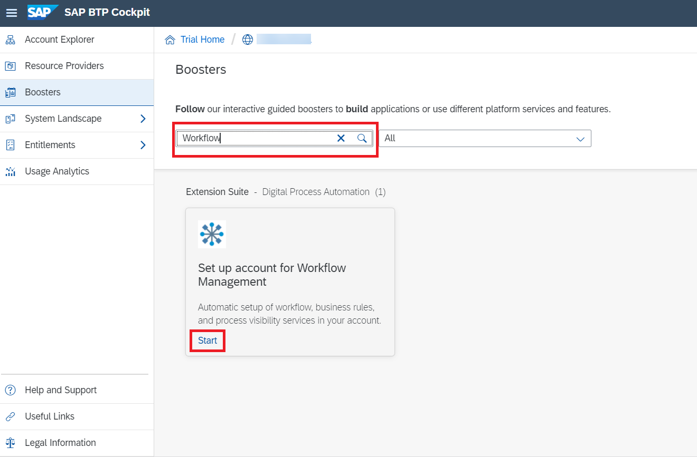
3. select subaccount, org and space and click **Finish**
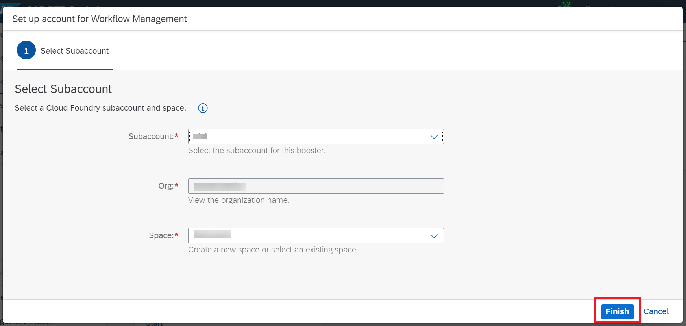
4. This will Result in the Below Progress.
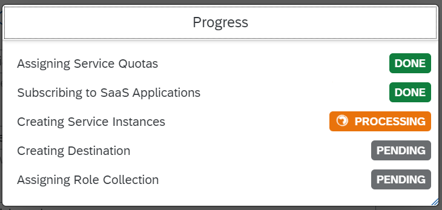
5. After the Booster completes Click on **Navigate to Subaccount**. For Further Details of setup Refer this [Blog](https://blogs.sap.com/2020/07/19/automatically-setup-workflow-management-in-sap-cloud-platform-using-booster/)
6. Now the required destinations are created, subscriptions are subscribed and roles are assigned.

#### Importing the business rules project

1. Fork and clone the repository into SAP Business Application Studio
```https://github.com/SAP-samples/s4hana-btp-extension-devops.git```
then 
```cd s4hana-btp-extension-devops```
```git checkout workflow_module```

> hint: clone the project into SAP Business Application Studio 

2. Navigate to **instances and subscriptions** in SAP BTP cockpit and open **workflow management**.
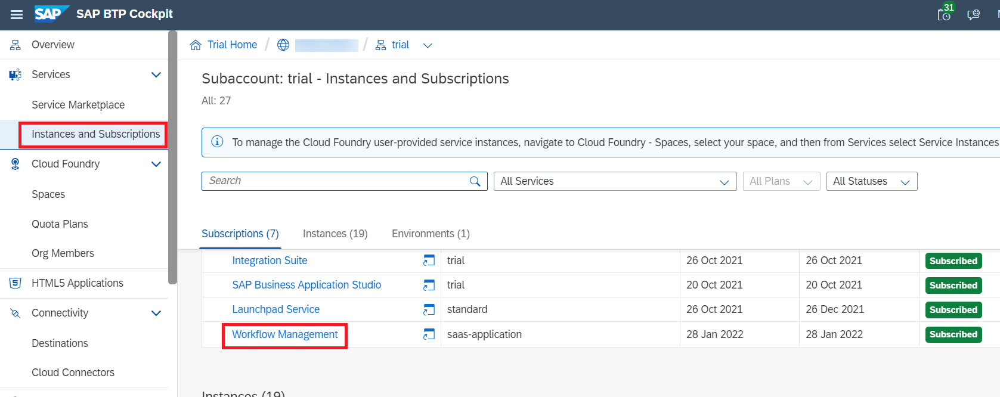
3. From the **Developement Tools** search for **Manage Rule Projects**

4. Click on Import project icon
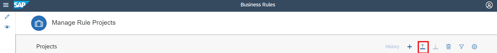
5. select the project in BusinessRulesProjects folder
6. it should result in the following screen 
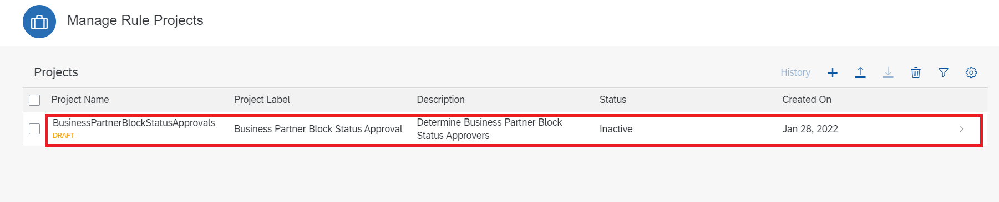
7. click on the project and navigate to data objects
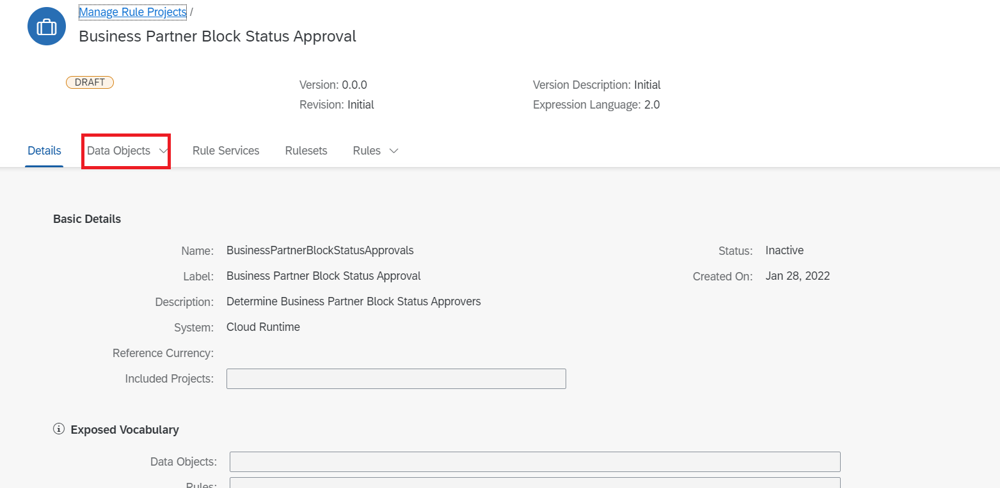
8. click on one of the Local Data Objects
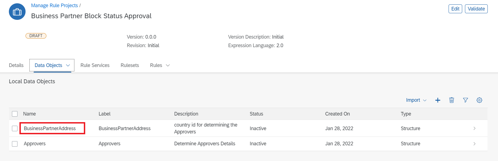
9. click on edit button
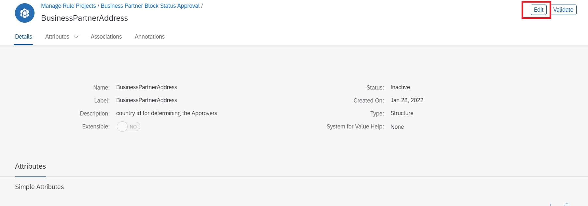
10. click on activate button
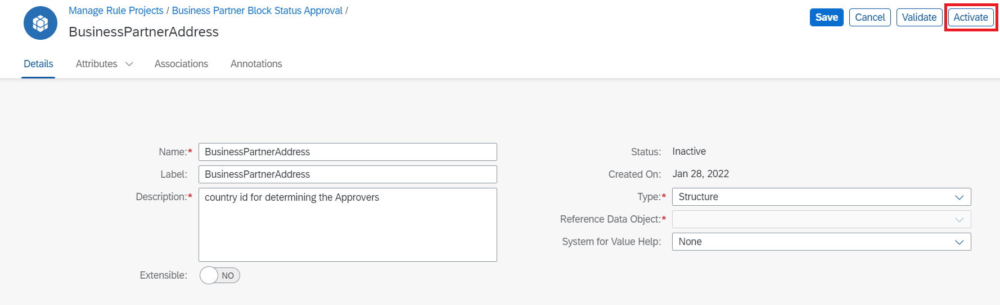
11. Status should be active now
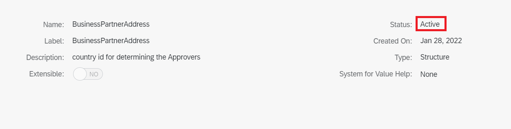
12. Repeat the process for **Approvers** 
13. Navigate to Project and click on rules 
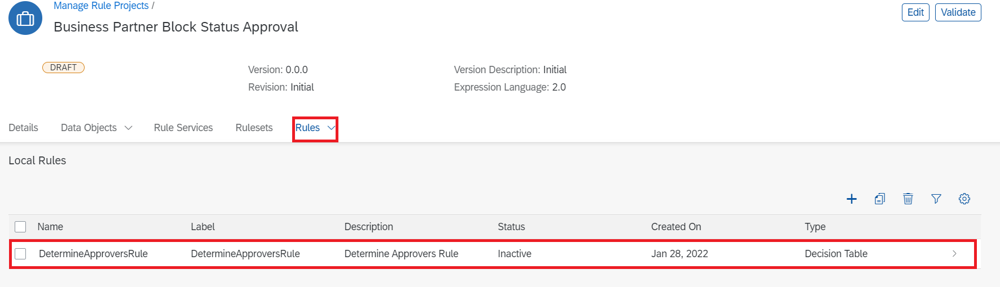
14. Click on **DetermineApproversRule** 
15. then click on **Edit**
16. Click activate

17. Navigate to business rules project and click on **Rule Services**
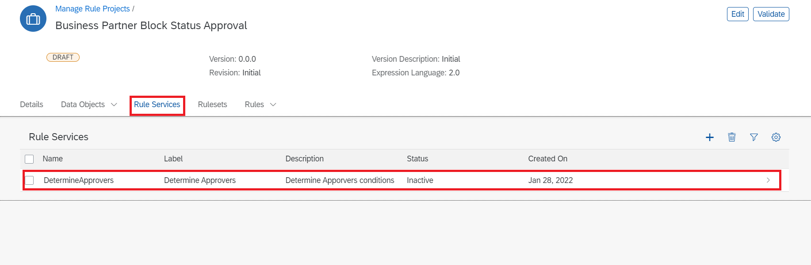
18. Click on **Edit** and then **Activate** the rule service 

19. Navigate to **Rulesets** in project and Activate the rule sets
20. Navigate to **RuleServices**  and click on deploy

21. In **Manage Rules Project** Click on **Release Version** fill the details as below and click **Release**
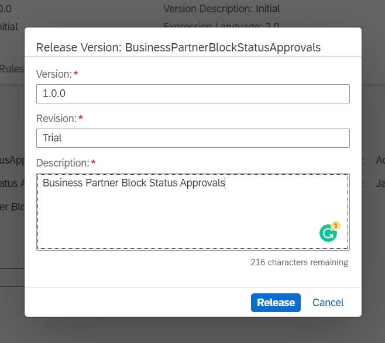
22. Follow  [Testing Business Rules](https://developers.sap.com/tutorials/cp-cf-businessrules09-test-apis.html) to test your deployed Business Rules.

#### Deploying Workflow Project

1. Clone the repository 
```https://github.com/<your username>/s4hana-btp-extension-devops.git``` into SAP Business Application Studio.
2. Checkout to **workflow_module**
3. Build mta.yaml
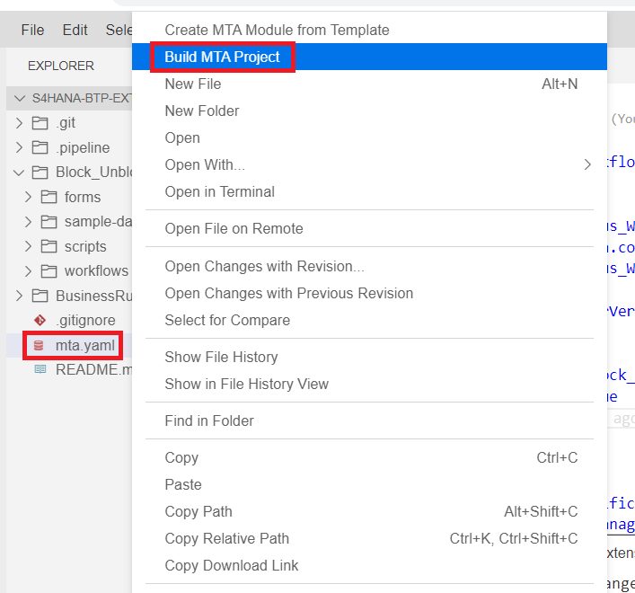
4. navigate to **mta_archives** and deploy mta archive file.
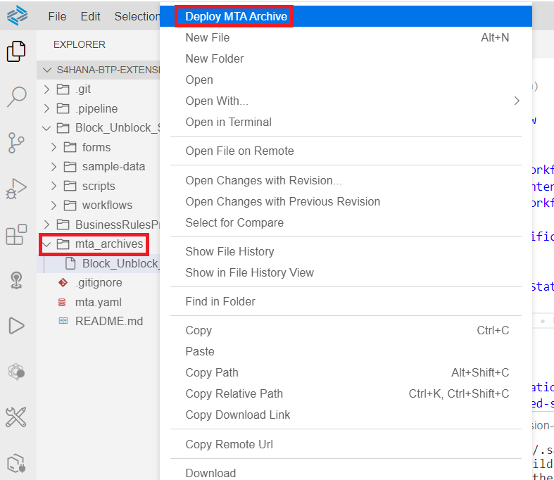
5. workflow project is successfully deployed.

#### Set up CICD pipeline and github webhook

1. Please follow [set up CICD](https://developers.sap.com/tutorials/btp-app-ci-cd-btp.html) till Step 5.
2. Click on Repository tab in SAP continuous Integration and Delivery, choose **+** to create a new repository
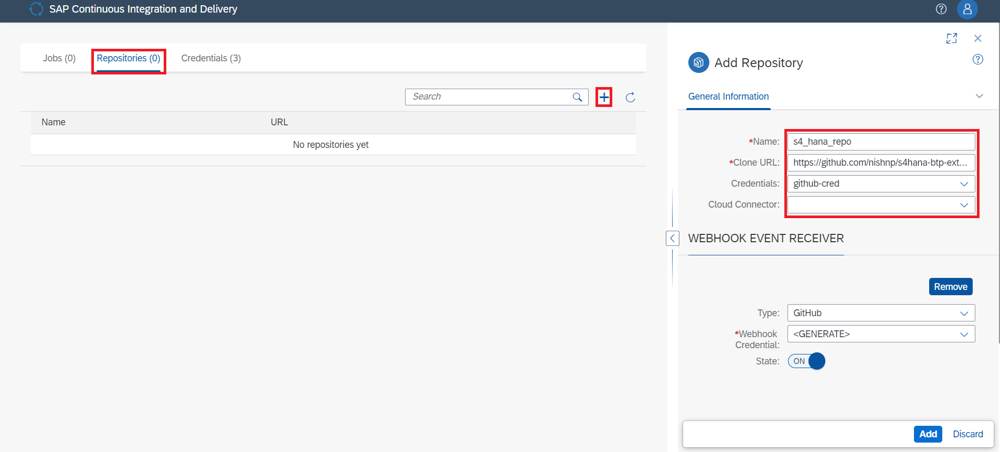
3. Fill in the below details

| Field   |      Value     |
|----------|:-------------:|
| name |  s4_hana_repo |
| clone url | https://github.com/username/s4hana-btp-extension-devops.git   |
| credentials| github-cred |
| Type| github |
| Webhook Credentials| Generate |
| State| ON |

> Note: Please remember change **username** in **clone url** and also **credentials** here refers to the github credentials that was configured.

then click on **Add**.

4. After the repositors is added. open the respository to get webhook data. Note down Payload URL, Content type, Secret.
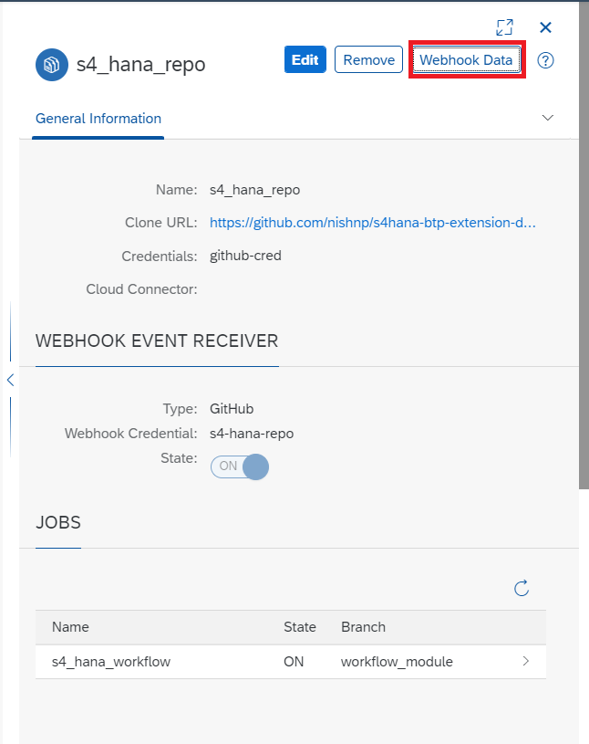

5. Goto github repository to add webhook data.
6. Click on the settings
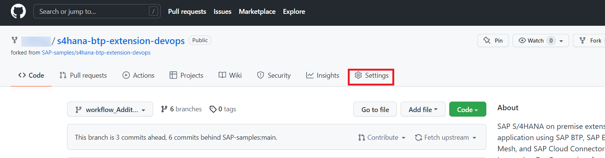
7. Click on webhooks and Add webhook

8. Fill the Payload URL, Content type, Secret and add webhook.

9. In the **Jobs** tab in SAP Continuous Integration and Delivery, choose **+** to create a new job.
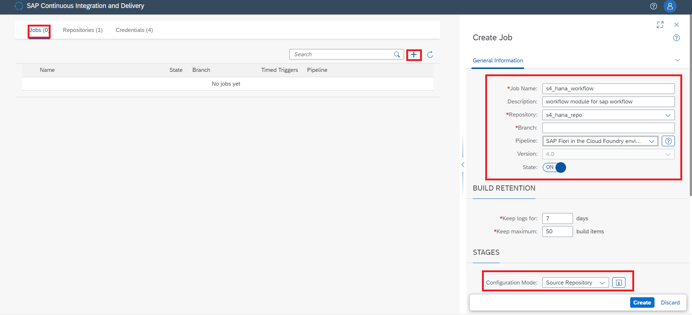

10. Please fill the below details

| Field   |      Value     |
|----------|:-------------:|
| name |  s4_hana_workflow |
| description |Block/unblock workflow module for sap workflow   |
| repository| s4_hana_repo |
| Branch| workflow_module |
| Pipeline| SAP Fiori in CLoud foundry environment |
| State| ON |
| Configuration mode| source repository |

11. Job is created and webhooks are added successfully.
12. Goto SAP BTP Business Application Studio. where you have cloned the repository.
13. open **config.yml** in **.pipeline** folder.

14. edit the details in cloud foundry deploy part. credentialsId is the cloud foundry credentials that were configured in SAP continuous integration and delivery. e.g here the credentials is cf-credential.

enter the api endpoint, org and space from SAP BTP cockpit.
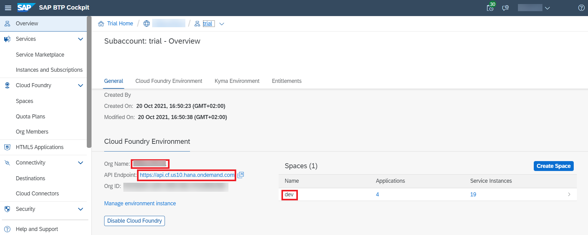

15. push the code to github. it should trigger the pipeline.


16. It should be completed successfully.

#### Add Destination for SAP CAP application

This destination is added because SAP cap application uses the destination to trigger the workflow.

1.  Go to SAP BTP cockpit and navigate to **instances and subscriptions**
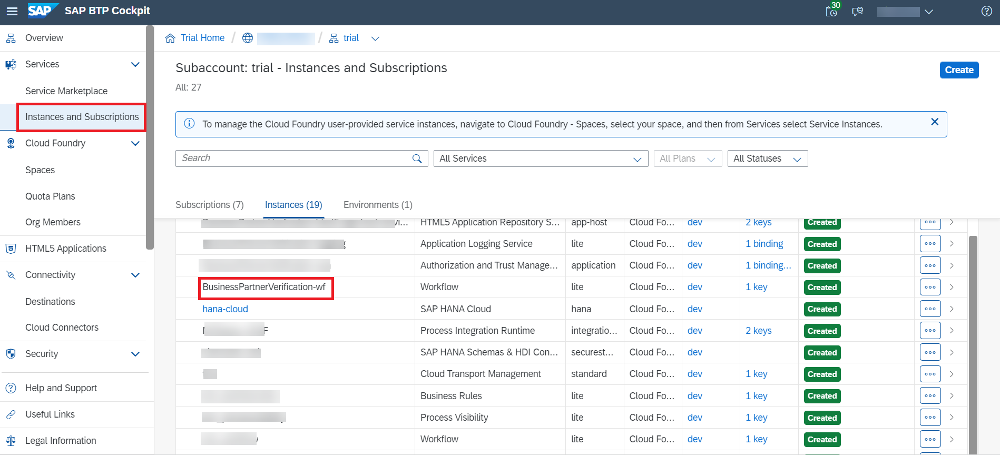
2. click on **BusinessPartnerVerification-wf** instance
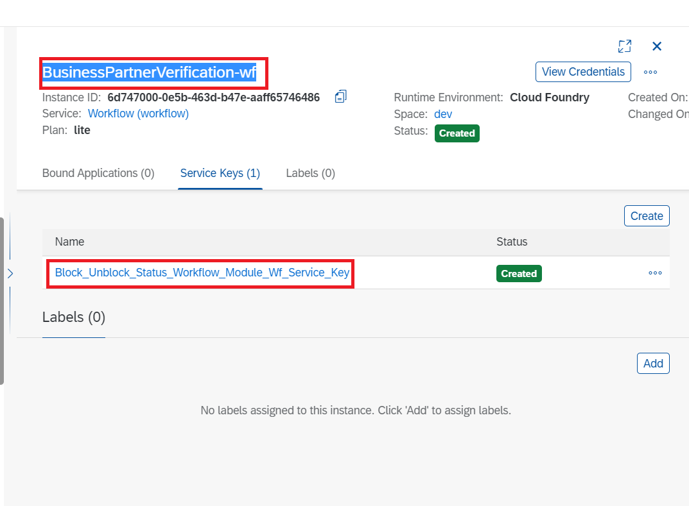
3. Click on service key and note down workflow_rest_url, clientid, clientsecret, url.
4. Navigate to **destinations** and click on **new destination **
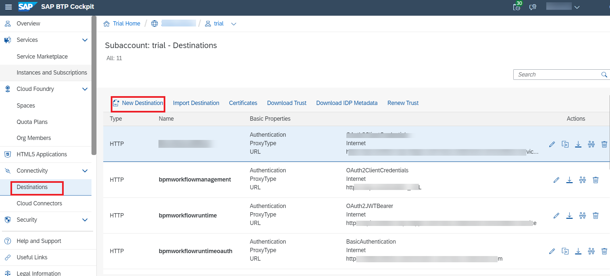
5. fill the details as below
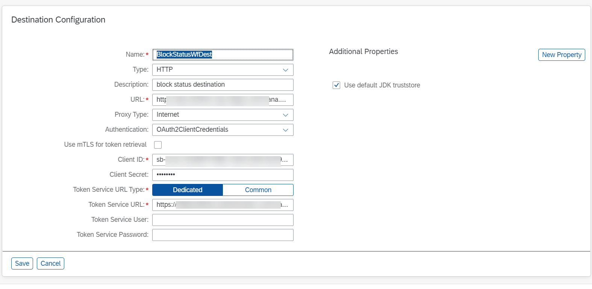

| Field   |      Value     |
|----------|:-------------:|
| name |  BlockStatusWfDest |
| Type |  HTTP |
| description |Block status destination   |
| URL| workflow_rest_url (from step 3) |
| Proxy Type| Internet |
| Authentication | Oauth2ClientCredentials |
| Client ID | clientid (from step 3) |
| Client secret| clientsecret (from step 3) |
| Token Service URL | url (from step 3)+ '/oauth/token' |

> Note: name of destination should be **BlockStatusWfDest** and token service url should have /oauth/token appended e.g. **https://{orgname}.authentication.us10.hana.ondemand.com/oauth/token**

6. Click **save**