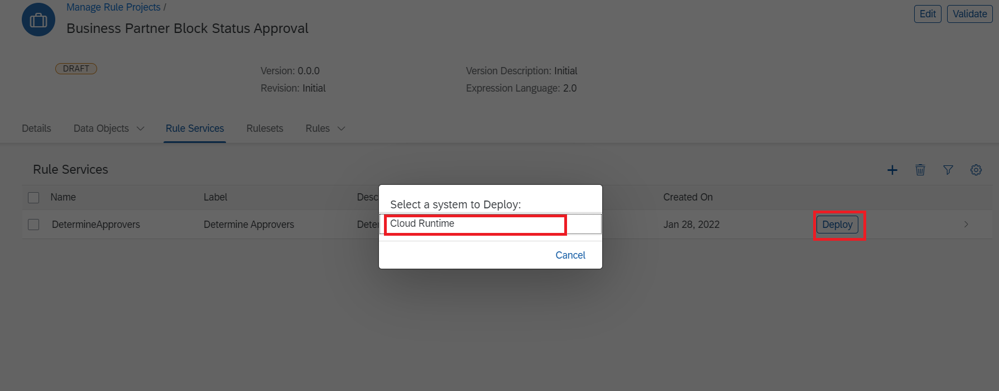

# Extend SAP S/4HANA Business Processes on SAP BTP by Leveraging DevOps

[](https://api.reuse.software/info/github.com/SAP-samples/s4hana-btp-extension-devops)

## Description

The main intent of this scenario is to complement an existing business process in an SAP solution – currently SAP S/4HANA with additional business process steps. This involves adding major logic and/or additional data and goes beyond simple UI changes. All of this is achieved by using DevOps tools and services provided by SAP BTP.

This application showcases:

- Building applications on SAP Business Technology Platform (BTP) using [SAP Cloud Application Programming Model(CAP)](https://cap.cloud.sap/docs/)
- Consuming events from SAP S/4HANA on premise using [SAP Event Mesh](https://help.sap.com/viewer/bf82e6b26456494cbdd197057c09979f/Cloud/en-US/df532e8735eb4322b00bfc7e42f84e8d.html)
- Consuming OData APIs from SAP S/4HANA on premise using SAP Business Technology Platform Connectivity Service
- Building a frontend for the CAP application using SAP Fiori Elements
- How to use the [Continous Integration and Delivery service](https://discovery-center.cloud.sap/serviceCatalog/continuous-integration-&-delivery?region=all)
- How to use [SAP Cloud Transport Management](https://discovery-center.cloud.sap/serviceCatalog/cloud-transport-management?service_plan=standard&region=all) in conjunction with the Continous Integration and Delivery service

## Business Scenario

A business scenario is used to showcase how to build a S/4 HANA on premise extension Application on SAP BTP.

John who is an employee of Business Partner Validation Firm iCredible, which is a third-party vendor of ACME Corporation would like to get notifications whenever new Business Partners are added in the S/4HANA backend system of ACME Corporation. John would then be able to review the Business Partner details in his extension app. He would proceed to visit the Business Partner’s registered office and do some background verification. John would then proceed to update/validate the verification details into the extension app. Once the details are verified, the Business Partner gets activated in the S/4HANA system of ACME Corporation.

- Custom extension application that works independently from S/4HANA.

- Changes in S/4 communicated via events in real time to extension application.

- Vendor personnel needs access to only custom app

### Solution Diagram


The Business Partner Validation application is developed using the SAP Cloud Application programming Model (CAP) and runs on the SAP BTP, Cloud Foundry runtime. It consumes platform services like SAP Event Mesh, SAP HANA Cloud and the Connectivity service. The events occuring in S/4 HANA on premise are inserted into the SAP Event Mesh queue. The application running in Cloud Foundry is notified on events, consumes them from the queue and inserts the event data into the HANA database. The Business Partner Validation Application uses S/4 HANA OData API's to read additional Business Partner Data from the S/4 HANA system. In case of updates performed by the third-party vendor the SAP Cloud SDK is used to update the corresponding data in the S/4HANA on premise system. 

## Requirements
The required systems and components are:

- SAP S/4HANA on premise system.
- SAP BTP account

Entitlements/Quota required in your SAP Business Technology Platform Account:

| Service                            | Plan        | Number of instances |
| ---------------------------------- | ----------- | ------------------- |
| Connectivity                       | lite        | 1                   |
| Destination                        | lite        | 1                   |
| HTML5 Application Repository       | app-host    | 1                   |
| Event Mesh                         | default     | 1                   |
| Application Logging                | lite        | 1                   |
| Authorization & Trust Management   | application | 1                   |
| SAP HANA Schemas & HDI Containers  | hdi-shared  | 1                   |
| SAP HANA Cloud                     |             |                     |
| Cloud Foundry runtime              |             |                     |
| Application Autoscaler             | standard    | 1                   |
| [Optional] SAP Private Link (BETA) | standard    | 1                   |


Subscriptions required in your SAP Business Technology Platform Account:

| Subscription                      | Plan             |
| --------------------------------- | ---------------- |
| SAP Business Application Studio   | standard         |
| Event Mesh                        | standard         |
| Launchpad Service                 | standard         |
| Continuous Integration & Delivery | default          |
| Cloud Transport Management        | saas-application |


## Setup & Configuration

### Step 1: [Identify APIs in API Business Hub](https://github.com/SAP-samples/s4hana-btp-extension-devops/tree/mission/01-IdentifyAPIFromAPIBusinessHub.md)
### Step 2: [S/4HANA Enable OData Service for business partner](https://github.com/SAP-samples/s4hana-btp-extension-devops/tree/mission/02-configure-oData-Service)

> Either follow Step 3a or 3b (not both) depending on whether you use an SAP BTP trial account or an SAP BTP enterprise account
### Step 3a: [Setup SAP BTP Enterprise Environment](https://github.com/SAP-samples/s4hana-btp-extension-devops/tree/mission/03-PrepareBTP)
### Step 3b: [Setup SAP BTP Trial Environment](https://github.com/SAP-samples/s4hana-btp-extension-devops/tree/mission/03-PrepareBTPTrial)
### Step 4: [Create SAP HANA Cloud instance](https://github.com/SAP-samples/s4hana-btp-extension-devops/tree/mission/04-SetupHANACloud)


There are two Options to establish connectivity between S/4HANA system and SAP BTP:
   * First one (see Step 5a) is the well know connectivity via **SAP Cloud Connector**
  
   * Second option (see Step 5b) is through new **SAP Private Link (BETA)** Service. In this way Cloud Foundry applications running on SAP BTP with Microsoft Azure as IaaS provider can communicate with Azure Private Link services via a private connection. This ensures that traffic is not routed through the public internet but stays within the Azure infrastructure.
  
   >Note: Currently, we only support the connection from SAP BTP Cloud Foundry to Azure Private Link services. 

   >Note, For the beta release, you can connect to Microsoft Azure Private Link Service running behind the Azure Standard Load Balancer.
 
Please continue either with Step 5a or 5b based on your scenario/requirement  
### Step 5a: [Setup connectivity between S/4HANA system, SAP BTP - SAP Cloud Connector](https://github.com/SAP-samples/s4hana-btp-extension-devops/tree/mission/05-CloudConnector)

### Step 5b: [Setup connectivity between S/4HANA system, SAP BTP - SAP Private Link (BETA)](https://github.com/SAP-samples/s4hana-btp-extension-devops/tree/mission/05-PrivateLink)

### Step 6: [Setup Workflow for Blocking and Unblocking Business Partner](https://github.com/SAP-samples/s4hana-btp-extension-devops/tree/mission/06-configureWorkflow)


#### Block Unblock Approval Workflow

**Description**

This is an extension to the original [Extend SAP S/4HANA Business Processes on SAP BTP by Leveraging DevOps](https://github.com/SAP-samples/s4hana-btp-extension-devops#extend-sap-s4hana-business-processes-on-sap-btp-by-leveraging-devops) where the Blocking and Unblocking of a Business Partner is done via SAP Workflow. When a Business Partner needs to be either Blocked/Unblocked then a Sap Workflow will be triggered then manager can either approve or reject the request. 

**Setup SAP Workflow** 

**Prepare your SAP Business Technology Platform Enterprise Account**
1. Navigate to **Boosters** in SAP BTP Cockpit

2. Search for **Workflow** and Click on **start**

3. select subaccount, org and space and click **Finish**

4. This will Result in the Below Progress.

5. After the Booster completes Click on **Navigate to Subaccount**. For Further Details of setup Refer this [Blog](https://blogs.sap.com/2020/07/19/automatically-setup-workflow-management-in-sap-cloud-platform-using-booster/)
6. Now the required destinations are created, subscriptions are subscribed and roles are assigned.

**Importing the business rules project**

1. Fork and clone the repository into SAP Business Application Studio
```https://github.com/SAP-samples/s4hana-btp-extension-devops.git``` 
then 
```cd s4hana-btp-extension-devops``` \
```git checkout workflow_module```

> hint: clone the project into SAP Business Application Studio 

2. Navigate to **instances and subscriptions** in SAP BTP cockpit and open **workflow management**.

3. From the **Developement Tools** search for **Manage Rule Projects**

4. Click on Import project icon

5. select the project in BusinessRulesProjects folder
6. it should result in the following screen 

7. click on the project and navigate to data objects

8. click on one of the Local Data Objects

9. click on edit button

10. click on activate button

11. Status should be active now

12. Repeat the process for **Approvers** 
13. Navigate to Project and click on rules 

14. Click on **DetermineApproversRule** 
15. then click on **Edit**
16. Click activate

17. Navigate to business rules project and click on **Rule Services**

18. Click on **Edit** and then **Activate** the rule service 

19. Navigate to **Rulesets** in project and Activate the rule sets
20. Navigate to **RuleServices**  and click on deploy

21. In **Manage Rules Project** Click on **Release Version** fill the details as below and click **Release**

22. Follow  [Testing Business Rules](https://developers.sap.com/tutorials/cp-cf-businessrules09-test-apis.html) to test your deployed Business Rules.

**Deploying Workflow Project**

1. Clone the repository 
```https://github.com/<your username>/s4hana-btp-extension-devops.git``` into SAP Business Application Studio.
2. Checkout to **workflow_module**
3. Build mta.yaml

4. navigate to **mta_archives** and deploy mta archive file.

5. workflow project is successfully deployed.

**Set up CICD pipeline and github webhook**

1. Please follow [set up CICD](https://developers.sap.com/tutorials/btp-app-ci-cd-btp.html) till Step 5.
2. Click on Repository tab in SAP continuous Integration and Delivery, choose **+** to create a new repository

3. Fill in the below details

| Field   |      Value     |
|----------|:-------------:|
| name |  s4_hana_repo |
| clone url | https://github.com/username/s4hana-btp-extension-devops.git   |
| credentials| github-cred |
| Type| github |
| Webhook Credentials| Generate |
| State| ON |

> Note: Please remember change **username** in **clone url** and also **credentials** here refers to the github credentials that was configured.

then click on **Add**.

4. After the repositors is added. open the respository to get webhook data. Note down Payload URL, Content type, Secret.


5. Goto github repository to add webhook data.
6. Click on the settings

7. Click on webhooks and Add webhook

8. Fill the Payload URL, Content type, Secret and add webhook.

9. In the **Jobs** tab in SAP Continuous Integration and Delivery, choose **+** to create a new job.


10. Please fill the below details

| Field   |      Value     |
|----------|:-------------:|
| name |  s4_hana_workflow |
| description |Block/unblock workflow module for sap workflow   |
| repository| s4_hana_repo |
| Branch| workflow_module |
| Pipeline| SAP Fiori in CLoud foundry environment |
| State| ON |
| Configuration mode| source repository |

11. Job is created and webhooks are added successfully.
12. Goto SAP BTP Business Application Studio. where you have cloned the repository.
13. open **config.yml** in **.pipeline** folder.

14. edit the details in cloud foundry deploy part. credentialsId is the cloud foundry credentials that were configured in SAP continuous integration and delivery. e.g here the credentials is cf-credential.

enter the api endpoint, org and space from SAP BTP cockpit.


15. push the code to github. it should trigger the pipeline.


16. It should be completed successfully.

**Add Destination for SAP CAP application**

This destination is added because SAP cap application uses the destination to trigger the workflow.

1.  Go to SAP BTP cockpit and navigate to **instances and subscriptions**

2. click on **BusinessPartnerVerification-wf** instance

3. Click on service key and note down workflow_rest_url, clientid, clientsecret, url.
4. Navigate to **destinations** and click on **new destination **

5. fill the details as below


| Field   |      Value     |
|----------|:-------------:|
| name |  BlockStatusWfDest |
| Type |  HTTP |
| description |Block status destination   |
| URL| workflow_rest_url (from step 3) |
| Proxy Type| Internet |
| Authentication | Oauth2ClientCredentials |
| Client ID | clientid (from step 3) |
| Client secret| clientsecret (from step 3) |
| Token Service URL | url (from step 3)+ '/oauth/token' |

> Note: name of destination should be **BlockStatusWfDest** and token service url should have /oauth/token appended e.g. **https://{orgname}.authentication.us10.hana.ondemand.com/oauth/token**

6. Click **save**

### Step 7: [Configure Business Application Studio and Build/Deploy the CAP application ](https://github.com/SAP-samples/s4hana-btp-extension-devops/tree/mission/06-ConfigureCAPApp)
### Step 8: [Configure Event Based Communication between S/4HANA and Event Mesh](https://github.com/SAP-samples/s4hana-btp-extension-devops/tree/mission/07-SetupEventMesh)
### Step 9: [Test scenario End to End](https://github.com/SAP-samples/s4hana-btp-extension-devops/tree/mission/08-TestApplication)
### Step 10: [Access and Discover Application Logs and Metrics](https://github.com/SAP-samples/s4hana-btp-extension-devops/tree/mission/09-ApplicationLogging)
### Step 11: [Setup of Continuous Integration and Continuous Delivery (CI/CD) ](https://github.com/SAP-samples/s4hana-btp-extension-devops/tree/mission/10-SetupCICD)
### Step 12: [Setup Cloud Transport Management ](https://github.com/SAP-samples/s4hana-btp-extension-devops/tree/mission/11-SetupTMS)
### Step 13: [Setup Alert Notification ](https://github.com/SAP-samples/s4hana-btp-extension-devops/tree/mission/12-SetupANS)
### Step 14 (optional): [Setup Application Autoscaler ](https://github.com/SAP-samples/s4hana-btp-extension-devops/tree/mission/13-SetupAppAutoscaler)


## How to obtain support

[Create an issue](https://github.com/SAP-samples/<repository-name>/issues) in this repository if you find a bug or have questions about the content.
 
For additional support, [ask a question in SAP Community](https://answers.sap.com/questions/ask.html).

## Contributing

## License
Copyright (c) 2021 SAP SE or an SAP affiliate company. All rights reserved. This project is licensed under the Apache Software License, version 2.0 except as noted otherwise in the [LICENSE](LICENSES/Apache-2.0.txt) file.
